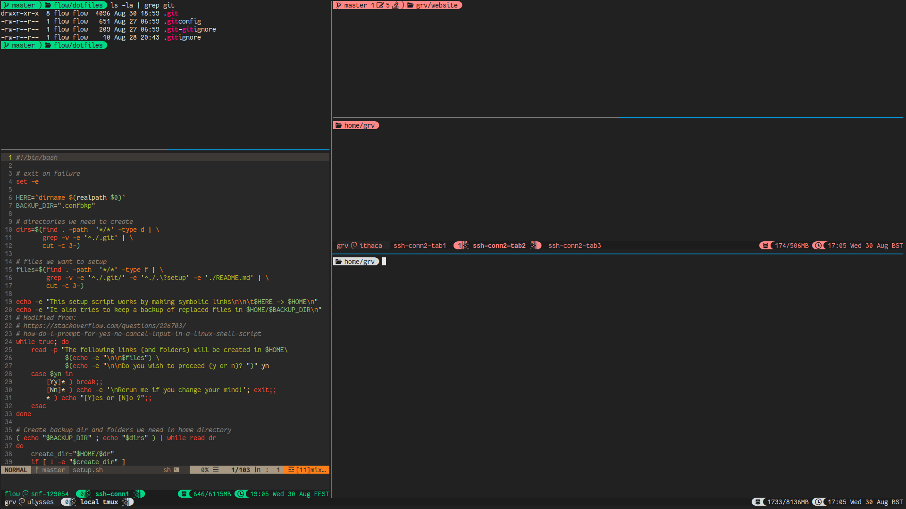

## My dotfiles

## Screenshot of tmux layout

The prompt colour is set depending on the hash of the hostname, therefore different ssh connections
will have different prompt colours (given there is no collision).

In white is the local tmux session while the green and reddish prompts are for ssh connections
to different machines. The bottom left pane is how vim looks modifying a bash script
(gruvbox colorscheme).

### Credits

#### Fonts
Fantasque Sans Mono + Nerdfonts

* original-font: https://github.com/belluzj/fantasque-sans
* patched font for powerline: https://github.com/ryanoasis/nerd-fonts

#### Terminal prompt ideas (Powerline)

* https://github.com/powerline/powerline
* https://github.com/banga/powerline-shell

#### Vim

See .vimrc plugins (constantly changing)

#### Tmux

##### Useful References

* http://tmuxp.readthedocs.io/en/latest/about_tmux.html
* http://blog.hawkhost.com/2010/07/02/tmux-%E2%80%93-the-terminal-multiplexer-part-2/
* http://www.hamvocke.com/blog/a-guide-to-customizing-your-tmux-conf/
* http://tangledhelix.com/blog/2012/07/16/tmux-and-mouse-mode/
* http://jasonwryan.com/blog/2011/06/07/copy-and-paste-in-tmux/
* https://github.com/christoomey/vim-tmux-navigator
